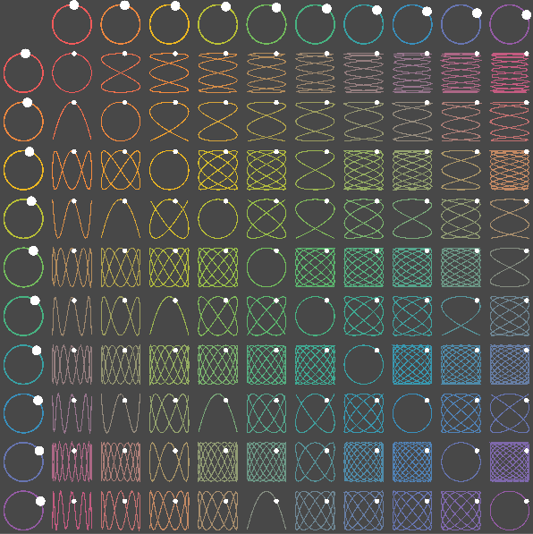
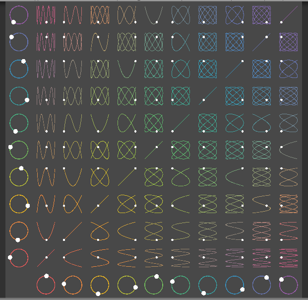
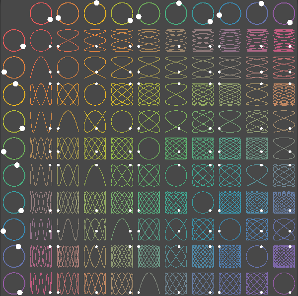
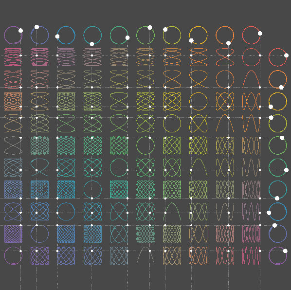

# Lissajous Curve
A simple project showing off the Lissajous Curve. 
Play with the sliders and see what patterns you can create.

Built using Unity Version 2018.3.11f1

|     |     |
:-------------------------:|:-------------------------:
  |  

#### Download Build
Windows Build - [Download]() 
macOS Build - [Download]()

#### Inspiration
Making a physical Lissajous curve - [standupmaths](https://youtu.be/4CbPksEl51Q) 
Coding Challenge #116: Lissajous Curve Table - [Coding Train](https://youtu.be/--6eyLO78CY)

#### Input
<table>
  <tr><td>Enter Key</td><td>Reload</td></tr>
  <tr><td>Space Key</td><td>Clear Trail</td></tr>
  <tr><td>Up Arrow Key</td><td>Increase Grid Size</td></tr>
  <tr><td>Down Arrow Key</td><td>Decrease Grid Size</td></tr>
  <tr><td>Esc Key</td><td>Close Application</td></tr>
  <tr><td>F Key</td><td>Full Screen Switch</td></tr>
</table>

#### Examples
Resize Grid            |  Grid Lines
:-------------------------:|:-------------------------:
  |   
